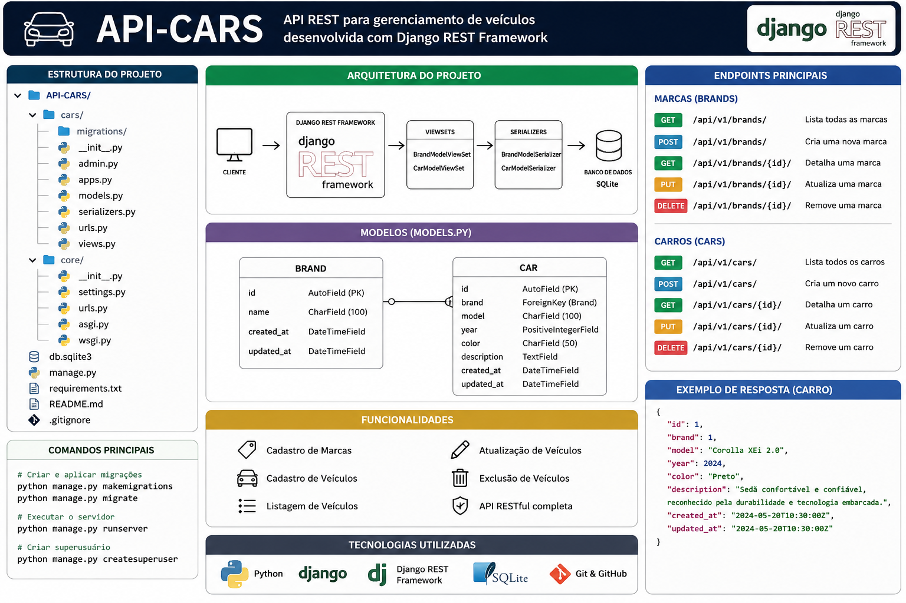

# 🚗 API-CARS

## Arquitetura do Projeto

<p align="center">
    
</p>

<p align="center">
  API REST para gerenciamento de veículos desenvolvida com Django REST Framework.
</p>

---

## 📖 Sobre o Projeto

O **API-CARS** é uma API RESTful desenvolvida em Python utilizando o Django REST Framework com o objetivo de gerenciar marcas e veículos.

O projeto foi criado para fins de aprendizado em desenvolvimento Backend, explorando conceitos como:

- Django
- Django REST Framework
- Serializers
- ViewSets
- Routers
- APIs RESTful
- SQLite
- Git e GitHub

---

## 🏗️ Arquitetura do Projeto

A aplicação segue a arquitetura padrão do Django REST Framework:

```text
Cliente
   │
   ▼
Endpoints REST
   │
   ▼
ViewSets
   │
   ▼
Serializers
   │
   ▼
Models
   │
   ▼
SQLite
```

---

## 📂 Estrutura do Projeto

```text
API-CARS/
│
├── cars/
│   ├── migrations/
│   ├── admin.py
│   ├── apps.py
│   ├── models.py
│   ├── serializers.py
│   ├── urls.py
│   └── views.py
│
├── core/
│   ├── settings.py
│   ├── urls.py
│   ├── asgi.py
│   └── wsgi.py
│
├── manage.py
├── db.sqlite3
├── requirements.txt
├── README.md
└── .gitignore
```

---

## ⚙️ Tecnologias Utilizadas

- Python 3
- Django
- Django REST Framework
- SQLite
- Git
- GitHub
- VS Code

---

## 🚘 Funcionalidades

### Marcas

- Criar marca
- Listar marcas
- Atualizar marca
- Remover marca

### Veículos

- Criar veículo
- Listar veículos
- Atualizar veículo
- Remover veículo

---

## 🌐 Endpoints

### Brands

| Método | Endpoint |
|----------|----------|
| GET | `/api/v1/brands/` |
| POST | `/api/v1/brands/` |
| GET | `/api/v1/brands/{id}/` |
| PUT | `/api/v1/brands/{id}/` |
| DELETE | `/api/v1/brands/{id}/` |

---

### Cars

| Método | Endpoint |
|----------|----------|
| GET | `/api/v1/cars/` |
| POST | `/api/v1/cars/` |
| GET | `/api/v1/cars/{id}/` |
| PUT | `/api/v1/cars/{id}/` |
| DELETE | `/api/v1/cars/{id}/` |

---

## 📦 Instalação

Clone o projeto:

```bash
git clone https://github.com/seu-usuario/api-cars.git
```

Entre na pasta:

```bash
cd api-cars
```

Crie o ambiente virtual:

```bash
python -m venv venv
```

Ative o ambiente virtual:

### Windows

```bash
venv\Scripts\activate
```

### Linux

```bash
source venv/bin/activate
```

Instale as dependências:

```bash
pip install -r requirements.txt
```

---

## 🗄️ Aplicando Migrações

```bash
python manage.py makemigrations
python manage.py migrate
```

---

## ▶️ Executando o Projeto

```bash
python manage.py runserver
```

Acesse:

```text
http://127.0.0.1:8000/api/v1/
```

---

## 👤 Criar Superusuário

```bash
python manage.py createsuperuser
```

Acesse:

```text
http://127.0.0.1:8000/admin/
```

---

## 📋 Exemplo de Resposta

```json
{
    "id": 1,
    "brand": 1,
    "model": "Corolla XEi 2.0",
    "factory_year": 2024,
    "model_year": 2025,
    "color": "Preto",
    "description": "Sedã confortável e confiável."
}
```

---

## 🎯 Objetivos de Aprendizagem

- Construção de APIs REST
- Serialização de dados
- Relacionamentos entre modelos
- CRUD completo
- Versionamento com Git
- Publicação no GitHub

---

## 👨‍💻 Autor

**Lúcio Fábio Barbosa de Lima**

Estudante de Análise e Desenvolvimento de Sistemas.

Full Stack de Dados e Analytics - Pod Academy.

---

## 📄 Licença

Projeto desenvolvido para fins educacionais.